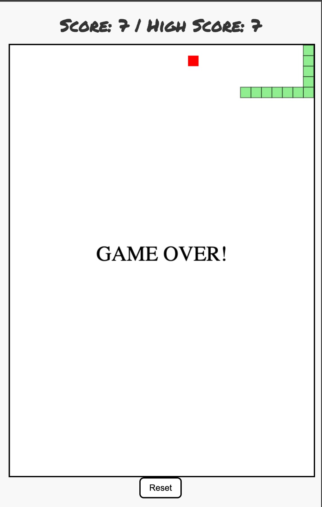

# 🐍 Snake Game (JavaScript + HTML Canvas)

A classic **Snake Game** built using vanilla JavaScript, HTML5 Canvas, and CSS. This project was developed to understand fundamental game loops, event handling, canvas rendering, and responsive UI design in front-end development.



---

## 🚀 Features

- 🎮 Classic Snake Gameplay
- 🍎 Random Food Generation
- 🧠 Prevents food from spawning inside the snake
- 💥 Game Over Detection (Wall and Self Collision)
- 🔁 Reset button and Spacebar to restart game
- 🧮 Score Tracking + Session High Score
- 📱 Responsive Canvas for all screen sizes
- 🎨 Stylish UI with Google Fonts

---

## 🛠️ Technologies Used

- HTML5
- CSS3
- JavaScript (ES6)
- Canvas API

---

## 📂 Project Structure

```bash
  snake-game/
├── index.html
├── style.css
├── index.js
├── screenshot.png
└── README.md
```


---

## ▶️ How to Run the Game Locally

1. **Clone the repository**
   ```bash
   git clone https://github.com/your-username/snake-game.git
   ```

2. **Navigate into the project directory
   ```bash
   cd snake-game
   ```

3. **Open index.html in your browser
   ```bash
   Just double-click the file, or

   Use Live Server in VS Code for automatic refresh
   ```

---

## 🕹️ Controls

```bash
   | Key          | Action                  |
| ------------ | ----------------------- |
| Arrow Keys   | Move Snake              |
| Spacebar     | Restart after Game Over |
| Reset Button | Manually reset game     |

   ```

---

## 🙌 Acknowledgements
Inspired by the retro snake game on Nokia phones.

Font: Permanent Marker by Google Fonts

---


---

### ✅ Notes:
- Replace `"your-username"`, `"yourprofile"`, and `"your-email@example.com"` with your actual GitHub, LinkedIn, and email.
- Add a `screenshot.png` image of your game in the project folder.
- If you'd like to **deploy it on GitHub Pages**, I can help you with that too.
